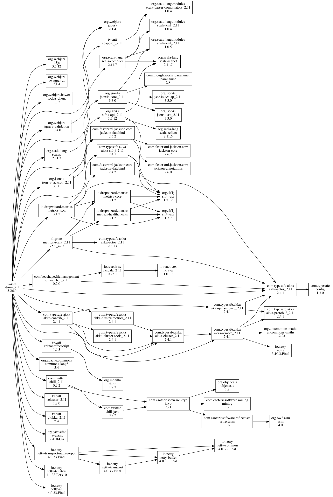

依存関係
========

依存ライブラリ
--------------

Xitrumは以下のライブラリにが依存しています。
つまりあなたのXitrumプロジェクトはこれらのライブラリを直接使用することができます。

主な依存ライブラリ:

* `Scala <http://www.scala-lang.org/>`_:
  XitrumはScalaで書かれています。
* `Netty <https://netty.io/>`_:
  WebSocketやゼロコピーファイルサービングなど
  Xitrumの非同期HTTP(S)サーバの多くの機能はNettyの機能を元に実現しています。
* `Akka <http://akka.io/>`_:
  主にSockJSのために。Akkaは `Typesafe Config <https://github.com/typesafehub/config>`_
  に依存しており、Xitrumもまたそれを使用しています。

その他の主な依存ライブラリ:

* `Commons Lang <http://commons.apache.org/lang/>`_:
  JSONデータのエスケープに使用しています。
* `Glokka <https://github.com/xitrum-framework/glokka>`_:
  SockJS アクターのクラスタリングに使用しています。
* `JSON4S <https://github.com/json4s/json4s>`_:
  JSONのパースと生成のために使用します。
  JSON4Sは `Paranamer <http://paranamer.codehaus.org/>`_ を依存ライブラリとして使用しています。
* `Rhino <https://developer.mozilla.org/en-US/docs/Rhino>`_:
  Scalate内でCoffeeScriptをJavaScriptにコンパイルするために使用しています。
* `Sclasner <https://github.com/xitrum-framework/sclasner>`_:
  クラスファイルとjarファイルからHTTPルートをスキャンするために使用しています。
* `Scaposer <https://github.com/xitrum-framework/scaposer>`_:
  国際化対応のために使用しています。
* `Twitter Chill <https://github.com/twitter/chill>`_:
  クッキーとセッションのシリアライズ・デシリアライズに使用しています。
  Chillは `Kryo <http://code.google.com/p/kryo/>`_ を元にしています。
* `SLF4S <http://slf4s.org/>`_, `Logback <http://logback.qos.ch/>`_:
  ロギングに使用しています。

`Xitrum プロジェクトスケルトン <https://github.com/xitrum-framework/xitrum-new>`_ は

以下のツールを梱包しています:

* `scala-xgettext <https://github.com/xitrum-framework/scala-xgettext>`_:
  コンパイル時に .scala ファイルから :doc:`国際化対応 </i18n>` 文字列を展開します。
* `xitrum-package <https://github.com/xitrum-framework/xitrum-package>`_:
  本番環境へデプロイするために :doc:`プロジェクトをパッケージング </deploy>` します。
* `Scalive <https://github.com/xitrum-framework/scalive>`_:
  ScalaコンソールからJVMプロセスに接続し、動的なデバッギングを可能にします。

関連プロジェクト
----------------

デモ:

* `xitrum-new <https://github.com/xitrum-framework/xitrum-new>`_:
  新規Xitrumプロジェクトのスケルトン。
* `xitrum-demos <https://github.com/xitrum-framework/xitrum-demos>`_:
  Xitrumの各機能のデモプロジェクト。
* `xitrum-placeholder <https://github.com/xitrum-framework/xitrum-placeholder>`_:
  Xitrumによる画像イメージアプリのデモ。
* `comy <https://github.com/xitrum-framework/comy>`_:
  XitrumによるURLショートナーアプリのデモ。
* `xitrum-multimodule-demo <https://github.com/xitrum-framework/xitrum-multimodule-demo>`_:
  `SBT <http://www.scala-sbt.org/>`_ マルチモジュールプロジェクトのデモ。

プラグイン:

* `xitrum-scalate <https://github.com/xitrum-framework/xitrum-scalate>`_:
  Xitrumのデフォルトテンプレートエンジン。`Xitrum プロジェクトスケルトン <https://github.com/xitrum-framework/xitrum-new>`_ で使用しています。
  別のテンプレートエンジンを使用することも、また必要がなければプロジェクトから削除してしまうことも可能です。
  xitrum-scalateは `Scalate <http://scalate.fusesource.org/>`_ と `Scalamd <https://github.com/chirino/scalamd>`_ に依存しています。
* `xitrum-hazelcast <https://github.com/xitrum-framework/xitrum-hazelcast>`_:
  キャッシュとサーバーサイドセッションのクラスタリングを行うプラグイン。
* `xitrum-ko <https://github.com/xitrum-framework/xitrum-ko>`_:
  `Knockoutjs <http://knockoutjs.com/>`_ を簡単に使うためのプラグイン。

その他のプロジェクト:

* `xitrum-doc <https://github.com/xitrum-framework/xitrum-doc>`_:
  `Xitrum Guide <http://xitrum-framework.github.io/guide.html>`_ のソースコード。
* `xitrum-hp <https://github.com/xitrum-framework/xitrum-framework.github.io>`_:
  `Xitrum Homepage <http://xitrum-framework.github.io/>`_ のソースコード。
