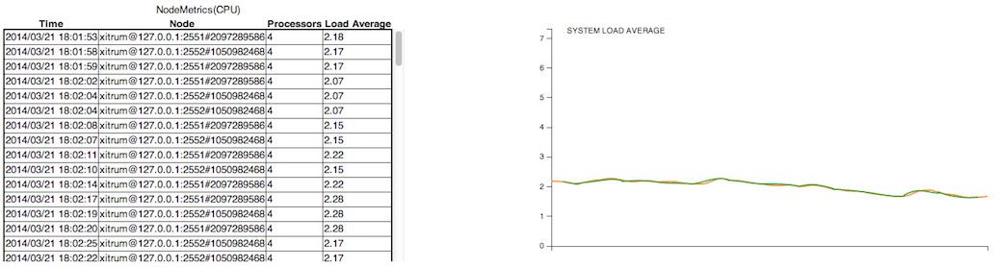
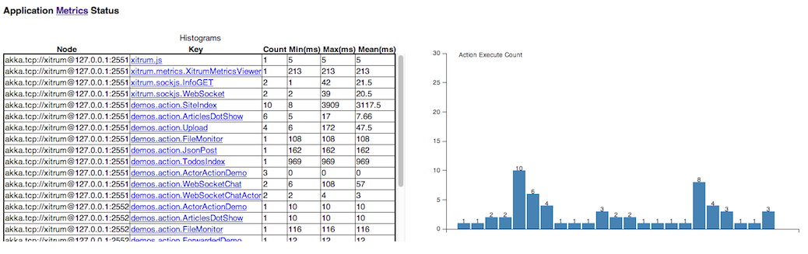
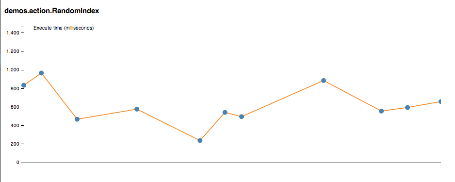
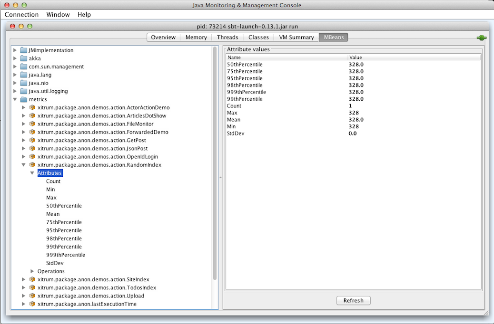

メトリクス
==========

XitrumはあなたのアプリケーションのJVMのヒープメモリーとCPUの使用量、
そしてアクションの実行ステータスをAkkaクラスタ上の各ノードから収集します。
それらのデータはメトリクスとしてJSONデータで配信する事ができます。
またメトリクスをカスタマイズすることも可能です。

この機能は `Coda Hale Metrics <http://metrics.codahale.com/>`_ を使用しています。

メトリクスの収集
----------------

ヒープメモリとCPU
~~~~~~~~~~~~~~~~~

JVMのヒープメモリとCPUはAkkaのactor systemの各ノードから `NodeMetrics <http://doc.akka.io/api/akka/2.3.0/index.html#akka.cluster.NodeMetrics>`_ として収集されます。

ヒープメモリ:

.. image:: ../img/metrics_heapmemory.png

CPU: プロセッサ数とロードアベレージ

アクションの実行ステータス
~~~~~~~~~~~~~~~~~~~~~~~~~~

Xitrumは各ノードにおける各アクションの実行ステータスを `Histogram <http://metrics.codahale.com/getting-started/#histograms>`_ として収集します。
アクションの実行回数や実行時間についてをここから知ることができます。

特定のアクションの最新の実行時間:

カスタムメトリクスの収集
~~~~~~~~~~~~~~~~~~~~~~~~

上記のメトリクスに加えて収集するメトリクスをカスタムすることができます。
``xitrum.Metrics`` は ``gauge``, ``counter``, ``meter``, ``timer`` そして ``histogram`` にアクセスするためのショートカットです。
これらの使い方は `Coda Hale Metrics <http://metrics.codahale.com/>`_ と `そのScala実装 <https://github.com/erikvanoosten/metrics-scala>`_ を参照ください。

例 Timer:

::

  import xitrum.{Action, Metrics}
  import xitrum.annotation.GET

  object MyAction {
    lazy val myTimer = Metrics.timer("myTimer")
  }

  @GET("my/action")
  class MyAction extends Action {
    import MyAction._

    def execute() {
      myTimer.time {
        // Something that you want to measure execution time
        ...
      }
      ...
    }
  }

メトリクスの配信
----------------

Xitrumは最新のメトリクスをJSONフォーマットで定期的に配信します。
収集されたデータは揮発性であり、永続的に保存はされません。

ヒープメモリー:

::

  {
    "TYPE"      : "heapMemory",
    "SYSTEM"    : akka.actor.Address.system,
    "HOST"      : akka.actor.Address.host,
    "PORT"      : akka.actor.Address.port,
    "HASH"      : akka.actor.Address.hashCode,
    "TIMESTAMP" : akka.cluster.NodeMetrics.timestamp,
    "USED"      : Number as byte,
    "COMMITTED" : Number as byte,
    "MAX"       : Number as byte
  }

CPU:

::

  {
    "TYPE"              : "cpu",
    "SYSTEM"            : akka.actor.Address.system,
    "HOST"              : akka.actor.Address.host,
    "PORT"              : akka.actor.Address.port,
    "HASH"              : akka.actor.Address.hashCode,
    "TIMESTAMP"         : akka.cluster.NodeMetrics.timestamp
    "SYSTEMLOADAVERAGE" : Number,
    "CPUCOMBINED"       : Number,
    "PROCESSORS"        : Number
  }

メトリクスレジストリは `metrics-json <http://metrics.codahale.com/manual/json/>`_ によってパースされます。.

Xitrumデフォルトビューア
~~~~~~~~~~~~~~~~~~~~~~~~

Xitrumはデフォルトで次のURLにメトリクスビューアを提供します。``/xitrum/metrics/viewer?api_key=<xitrum.confの中のキー>``
このURLでは上記のような `D3.js <http://d3js.org/>`_ によって生成されたグラフを参照することができます。

URLが動的に算出できます:

::

  import xitrum.Config
  import xitrum.metrics.XitrumMetricsViewer

  url[XitrumMetricsViewer]("api_key" -> Config.xitrum.metrics.get.apiKey)

Jconsoleビューア
~~~~~~~~~~~~~~~~

`JVM Reporter <http://metrics.codahale.com/getting-started/#reporting-via-jmx>`_ を使用することも可能です。

JVM Reporterの開始方法:

::

  import com.codahale.metrics.JmxReporter

  object Boot {
    def main(args: Array[String]) {
      Server.start()
      JmxReporter.forRegistry(xitrum.Metrics).build().start()
    }
  }

アプリケーション起動後 `jconsole <http://docs.oracle.com/javase/7/docs/technotes/guides/management/jconsole.html>`_ コマンドをターミナルから実行します。

カスタムビューア
~~~~~~~~~~~~~~~~

メトリクスはJSONとしてSockJS URL ``xitrum/metrics/channel`` から取得する事ができます。
``jsAddMetricsNameSpace`` はそのURLへ接続するためのJavaScriptスニペットをビューに出力します。
JavaScriptでJSONハンドラを実装し、``initMetricsChannel`` を呼び出してください。

例:

::

  import xitrum.annotation.GET
  import xitrum.metrics.MetricsViewer

  @GET("my/metrics/viewer")
  class MySubscriber extends MetricsViewer {
    def execute() {
      jsAddMetricsNameSpace("window")
      jsAddToView("""
        function onValue(json) {
          console.log(json);
        }
        function onClose(){
          console.log("channel closed");
        }
        window.initMetricsChannel(onValue, onClose);
      """)
      respondView()
    }
  }

メトリクスの保存
~~~~~~~~~~~~~~~~

メモリ消費を抑制するため、Xitrumは過去のメトリクス情報について保持することはありません。
データベースやファイルへの書き出しが必要な場合、独自のサブスクライバーを実装する必要があります。

例:

::

  import akka.actor.Actor
  import xitrum.metrics.PublisherLookUp

  class MySubscriber extends Actor with PublisherLookUp {
    override def preStart() {
      lookUpPublisher()
    }

    def receive = {
      case _ =>
    }

    override def doWithPublisher(globalPublisher: ActorRef) = {
      context.become {
        // When run in multinode environment
        case multinodeMetrics: Set[NodeMetrics] =>
          // Save to DB or write to file.

        // When run in single node environment
        case nodeMetrics: NodeMetrics =>
          // Save to DB or write to file.

        case Publish(registryAsJson) =>
          // Save to DB or write to file.

        case _ =>
      }
    }
  }
