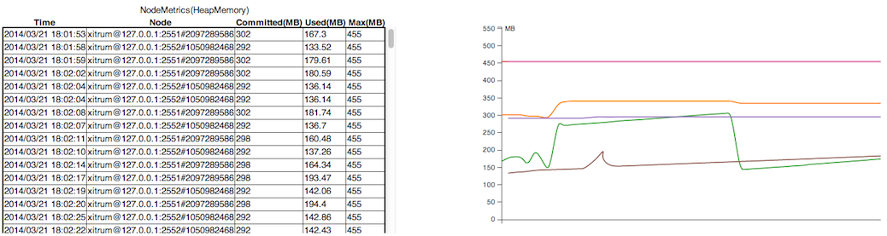

Metrics
=======

Xitrum collects JVM heap memory, CPU, and actions' execution status from each
node of your application's Akka cluster. It publishes the metrics as JSON data.
Xitrum also lets you publish your own metrics.

This metrics feature is based on the library `Coda Hale Metrics <http://metrics.codahale.com/>`_.

Collect metrics
---------------

Heap memory and CPU
~~~~~~~~~~~~~~~~~~~

JVM heap memory and CPU will be collected as
`NodeMetrics <http://doc.akka.io/api/akka/2.3.0/index.html#akka.cluster.NodeMetrics>`_
of Akka actor system from each node.

Heap memory:

CPU: Number of processors and load average

.. image:: metrics_cpu.png

Action metrics
~~~~~~~~~~~~~~

Xitrum measure actions' execution status of each node as a
`Histogram <http://metrics.codahale.com/getting-started/#histograms>`_.
You can know how many times actions were executed, and execution time of
non-async actions.

.. image:: metrics_action_count.png

Latest execution time of a specific action:

.. image:: metrics_action_time.png

Collect your custom metrics
~~~~~~~~~~~~~~~~~~~~~~~~~~~

In addition to default metrics above, you can collect your custom metrics.
``xitrum.Metrics`` is a shortcut for ``gauge``, ``counter``, ``meter``,
``timer`` and ``histogram``. Please read about
`Coda Hale Metrics <http://metrics.codahale.com/>`_ and
`its Scala implementation <https://github.com/erikvanoosten/metrics-scala>`_
to know how to use them.

Timer example:

::

  import xitrum.{Action, Metrics}
  import xitrum.annotation.GET

  object MyAction {
    lazy val myTimer = Metrics.timer("myTimer")
  }

  @GET("my/action")
  class MyAction extends Action {
    import MyAction._

    def execute() {
      myTimer.time {
        // Something that you want to measure execution time
        ...
      }
      ...
    }
  }

Publish metrics
---------------

Xitrum publish latest value of metrics as JSON format with specified interval.
This is a volatile value and not be kept in persistently.

HeapMemory:

::

  {
    "TYPE"      : "heapMemory",
    "SYSTEM"    : akka.actor.Address.system,
    "HOST"      : akka.actor.Address.host,
    "PORT"      : akka.actor.Address.port,
    "HASH"      : akka.actor.Address.hashCode,
    "TIMESTAMP" : akka.cluster.NodeMetrics.timestamp,
    "USED"      : Number as byte,
    "COMMITTED" : Number as byte,
    "MAX"       : Number as byte
  }

CPU:

::

  {
    "TYPE"              : "cpu",
    "SYSTEM"            : akka.actor.Address.system,
    "HOST"              : akka.actor.Address.host,
    "PORT"              : akka.actor.Address.port,
    "HASH"              : akka.actor.Address.hashCode,
    "TIMESTAMP"         : akka.cluster.NodeMetrics.timestamp
    "SYSTEMLOADAVERAGE" : Number,
    "CPUCOMBINED"       : Number,
    "PROCESSORS"        : Number
  }

MetricsRegistry will be parsed with `metrics-json <http://metrics.codahale.com/manual/json/>`_.

Xitrum default viewer
~~~~~~~~~~~~~~~~~~~~

Xitrum provides default metrics viewer at URL ``/xitrum/metrics/viewer``.
This URL shows graphs like above. The graphs are created using `D3.js <http://d3js.org/>`_.

Jconsole viewer
~~~~~~~~~~~~~~

You can see it with `JVM Reporter <http://metrics.codahale.com/getting-started/#reporting-via-jmx>`_.

.. image:: metrics_jconsole.png

Start JMX reporter:

::

  import com.codahale.metrics.JmxReporter

  object Boot {
    def main(args: Array[String]) {
      Server.start()
      JmxReporter.forRegistry(xitrum.Metrics).build().start()
    }
  }

Then run the `jconsole <http://docs.oracle.com/javase/7/docs/technotes/guides/management/jconsole.html>`_ command.

Display metrics with custom viewer
~~~~~~~~~~~~~~~~~~~~~~~~~~~~~~~~~~

The metrics will be published at SockJS URL ``xitrum/metrics/channel`` as JSON.
``jsAddMetricsNameSpace`` is a convenient JavaScript snippet that Xitrum provides
for creating connection to this endpoint.

Implement your own JSON handler, and call ``initMetricsChannel`` with your handler.

Action example:

::

  import xitrum.annotation.GET
  import xitrum.metrics.MetricsViewer

  @GET("my/metrics/viewer")
  class MySubscriber extends MetricsViewer {
    def execute() {
      jsAddMetricsNameSpace("window")
      jsAddToView("""
        function onValue(json) {
          console.log(json);
        }
        function onClose(){
          console.log("channel closed");
        }
        window.initMetricsChannel(onValue, onClose);
      """)
      respondView()
    }
  }

Save metrics
~~~~~~~~~~~~

To save memory, Xitrum doesn't remember old metrics values. If you want to save
metrics to the database or files for later use, you need to implement your custom
subscriber.

Example:

::

  import akka.actor.Actor
  import xitrum.metrics.PublisherLookUp

  class MySubscriber extends Actor with PublisherLookUp {
    override def preStart() {
      lookUpPublisher()
    }

    def receive = {
      case _ =>
    }

    override def doWithPublisher(globalPublisher: ActorRef) = {
      context.become {
        // When run in multinode environment
        case multinodeMetrics: Set[NodeMetrics] =>
          // Save to DB or write to file.

        // When run in single node environment
        case nodeMetrics: NodeMetrics =>
          // Save to DB or write to file.

        case Publish(registryAsJson) =>
          // Save to DB or write to file.

        case _ =>
      }
    }
  }
