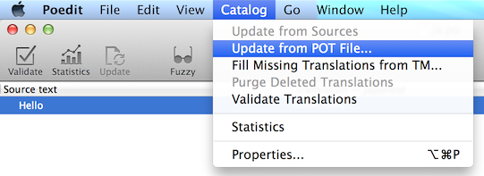

I18n
====

Phong cách GNU gettext được sử dụng. Không giống như các i18n method khác, gettext
hỗ trợ đa số các form.

.. image:: ../img/poedit.png

Viết các internationalized messages vào source code
---------------------------------------------------

``xitrum.Action`` kế thừa ``xitrum.I18n``, và có 2 method sau:

::

  t("Message")
  tc("Context", "Message")

  t("Hello %s").format("World")

  // 1$ and 2$ are placeholders
  t("%1$s says hello to %2$s, then %2$s says hello back to %1$s").format("Bill", "Hillary")

  // {0} and {1} are placeholders
  java.text.MessageFormat.format(t("{0} says hello to {1}, then {1} says hello back to {0}"), "Bill", "Hillary")

  t("%,.3f").format(1234.5678)                                // => 1,234.568
  t("%,.3f").formatLocal(java.util.Locale.FRENCH, 1234.5678)  // => 1 234,568

::

  // Above, you explicitly specify locale.
  // If you want to implicitly use locale of the current action:
  // when English => 1,234.568, when French => 1 234,568
  t("%,.3f", 1234.5678)

Bạn có thể gọi trực tiếp 2 method trên từ trong action.
Tại một nơi khác như model, bạn cần truyền current action vào đó và gọi ``t`` và
``tc``.
::

  // In an action
  respondText(MyModel.hello(this))

  // In the model
  import xitrum.I18n
  object MyModel {
    def hello(i18n: I18n) = i18n.t("Hello World")
  }

Triển khai các tin nhắn đến tệp pot
-----------------------------------

Tạo một tệp i18n.pot trong thư mục gốc của project, sau đó biên dịch lại cả
project.

::

  sbt/sbt clean
  rm i18n.pot
  touch i18n.pot
  sbt/sbt compile

``sbt/sbt clean`` dùng để xóa tất cả các tệp .class , bắt SBT biên dịch lại cả
project. Vì sau ``sbt/sbt clean``, SBT sẽ thử tải lại toàn bộ :doc:`dependencies </deps>`,
bạn có thể tiến hành nhanh hơn một chút với lệnh ``find target -name *.class -delete``,
nó sẽ xóa toàn bộ các tệp . class trong thư mục ``target``.

Sau khi biên dịch lại, i18n.pot sẽ được lấp đầy với các gettext message triển khai
từ mã nguồn. Để làm điều này, `Scala compiler plugin technique <http://www.scala-lang.org/node/140>`_
được sử dụng.

Tuy nhiên, phương pháp này sẽ chỉ trích rút dữ liệu từ mã nguồn. Nếu bạn có các
tệp Java, bạn có thể sử dụng câu lệnh ``xgettext`` để trích xuất dữ liệu:

::

  xgettext -kt -ktc:1c,2 -ktn:1,2 -ktcn:1c,2,3 -o i18n_java.pot --from-code=UTF-8 $(find src/main/java -name "*.java")

Sau đó bạn gộp tệp i18n_java.pot và tệp i18n.pot.

Lưu các tệp .po tại đâu
-----------------------

i18n.pot là một tệp bản mẫu. Bạn cần sao chép nó đến tệp <language>.po và dịch.

Xitrum theo dõi thư mực có tên ``i18n`` trong classpath.
Nếu một tệp <language>.po trong thư mục đó được thay đổi hoặc được thêm vào ở runtime,
Xitrum sẽ tự động tải lại tệp <language>.po đó.

::

  src
    main
      scala
      view
      resources
        i18n
          ja.po
          vi.po
          ...

Sử dụng công cụ như `Poedit <http://www.poedit.net/>`_ để edit các tệp .po.
Bạn cũng có thể sử dụng nó để hợp các tệp pot mới vào tệp po cũ.

Bạn có thể đóng gói các tệp .po trong nhiều tệp JAR. Xitrum sẽ tự động gộp chúng
khi chạy.

::

  mylib.jar
    i18n
      ja.po
      vi.po
	  ...

  another.jar
    i18n
      ja.po
      vi.po
	  ...

Chọn ngôn ngữ
-------------

* Để lấy cấc ngôn ngữ trong ``Accept-Language`` request header bởi browser, gọi
  ``browserLanguages``. Kết quả sẽ được sắp xếp theo mức ưu tiên đặt bởi trình duyệt
  từ cao xuống thấp.
* Ngôn ngữ mặc định là "en". Để chuyển ngôn ngữ, ví dụ Nhật Bản, gọi ``language = "ja"``
* Để tự đặt ngôn ngữ phù hợp nhất trong resource, gọi
  ``autosetLanguage(availableLanguages)``, với
  ``availableLanguages`` là một list các ngôn ngữ có trong thư mục
  ``resources/i18n`` và các tệp JAR.
  Nếu không có ngôn ngữ nào phù hợp, ngôn ngữ vẫn mặc định là "en".
* Để lấy ngôn ngữ hiện thời được đặt bên trên, sử dụng ``language``.

Trong action, thông thường trong một before filter, để đặt ngôn ngữ:

::

  beforeFilter {
    val lango: Option[String] = yourMethodToGetUserPreferenceLanguageInSession()
    lango match {
      case None       => autosetLanguage(Locale.forLanguageTag("ja"), Locale.forLanguageTag("vi"))
      case Some(lang) => language = lang
    }
  }

Validation messages
-------------------

jQuery Validation plugin cung cấp `i18n error messages <https://github.com/jzaefferer/jquery-validation/tree/master/src/localization>`_.
Xitrum tự động thêm các tệp message tương ứng vào ngôn ngữ hiện thời.

Với validator mặc định ở phía server trong package ``xitrum.validator``, Xitrum cũng
cung cấp bản dịch tương ứng.

Với đa số form
--------------

::

  tn("Message", "Plural form", n)
  tcn("Context", "Message", "Plural form", n)

Xitrum chỉ có thể chạy đúng với đa số form sau:

* `What are plural forms <http://www.gnu.org/software/gettext/manual/html_node/Plural-forms.html#Plural-forms>`_
* `Translating plural forms <http://www.gnu.org/software/gettext/manual/html_node/Translating-plural-forms.html#Translating-plural-forms>`_

Phần lớn các form thường nằm trong số sau:

::

  nplurals=1; plural=0
  nplurals=2; plural=n != 1
  nplurals=2; plural=n>1
  nplurals=3; plural=n%10==1 && n%100!=11 ? 0 : n != 0 ? 1 : 2
  nplurals=3; plural=n==1 ? 0 : n==2 ? 1 : 2
  nplurals=3; plural=n==1 ? 0 : (n==0 || (n%100 > 0 && n%100 < 20)) ? 1 : 2
  nplurals=3; plural=n%10==1 && n%100!=11 ? 0 : n%10>=2 && (n%100<10 || n%100>=20) ? 1 : 2
  nplurals=3; plural=n%10==1 && n%100!=11 ? 0 : n%10>=2 && n%10<=4 && (n%100<10 || n%100>=20) ? 1 : 2
  nplurals=3; plural=(n==1) ? 0 : (n>=2 && n<=4) ? 1 : 2
  nplurals=3; plural=n==1 ? 0 : n%10>=2 && n%10<=4 && (n%100<10 || n%100>=20) ? 1 : 2
  nplurals=4; plural=n%100==1 ? 0 : n%100==2 ? 1 : n%100==3 || n%100==4 ? 2 : 3

Định dạng ngày và số
--------------------

Nếu bạn sử dụng Scalate template engine, mặc định ngày và số sẽ được định dạng theo
ngôn ngữ hiện thời.

Nếu bạn muốn sử dụng định dạng khác:

::

  import java.text.{DateFormat, NumberFormat}

  val myDateFormat   = ...
  val myNumberFormat = ...
  val options        = Map("date" -> myDateFormat, "number" -> myNumberFormat)
  respondView(options)
